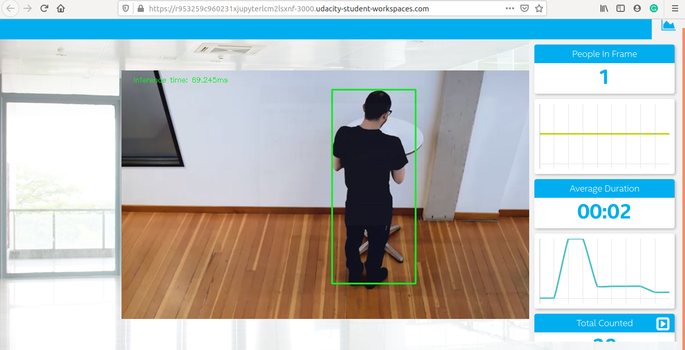

# Project Write-Up            

OpenVINO people counter app deployment at edge. The Intel's distribution of openVINO toolkit allow us to deploy models at the edge with less compuation power required for edge resources. In this project we developed a people counter app comparing different models, pre and post IR conversions and computing the performance/sizes of the models. Read the complete guide to get further insight into the Intel's distribution of openVINO toolkit.

## Explaining Custom Layers

The list of  supported layers directly relates to whether a given layer is a custom layer. If a layer is not in the list of supported layers is automatically classified as a custom layer by the Model Optimizer.

There are some options to add custom layers:

### For Caffe Models

#### Option 01: 
Register the custom layers as extensions to the Model Optimizer. When your custom layers are registered as extensions, the Model Optimizer generates a valid and optimized Intermediate Representation. And then we can generate a valid Intermediate Representation according to the rules specified. In this option the availability of Caffe on local machine is not required.

#### Option 02: 
Register the custom layers as Custom and use the system Caffe to calculate the output shape of each Custom Layer, which is required by the Intermediate Representation format. For this method, the Model Optimizer requires the Caffe Python interface on the system. When registering the custom layer in the CustomLayersMapping.xml file, we can specify if layer parameters should appear in Intermediate Representation or if they should be skipped.

Note: If your layer output shape depends on dynamic parameters, input data or previous layers parameters, calculation of output shape of the layer via Caffe can be incorrect. In this case, patch to Caffe is required.
If the calculation of output shape of the layer via Caffe fails inside the framework, Model Optimizer is unable to produce any correct Intermediate Representation and a patch is also required in the Caffe.

### For TensorFlow Models

#### Option 01: 
This option is similar to Option 01 of Caffe Model. Register the custom layers as extensions to the Model Optimizer. When your custom layers are registered as extensions, the Model Optimizer generates a valid and optimized Intermediate Representation.

#### Option 02: 
Replace the unsupported subgraph with a different subgraph. The sub-graphs that should not be expressed with the analogous sub-graph in the Intermediate Representation, but another sub-graph should appear in the model, the Model Optimizer provides such an option. This feature is helpful for many TensorFlow models.

#### Option 03: 
Offload the computation of the subgraph back to TensorFlow during inference.


### MXNet Models with Custom Layers

#### Option 01: 
Register the custom layers as extensions to the Model Optimizer.When the custom layers are registered as extensions, the Model Optimizer generates a valid and optimized Intermediate Representation.

#### Option 02: 
If there are sub-graphs that should not be expressed with the analogous sub-graph in the Intermediate Representation, but another sub-graph should appear in the model, the Model Optimizer provides such an option. In MXNet the function is actively used for ssd models provides an opportunity to for the necessary subgraph sequences and replace them.

It is necessary to cope with custom layers so that the performace of the model at the edge may not be compromised. 

## Comparing Model Performance

I have converted different models into IR and compared the performance and my results are given below.

#### First Model: [SSD Lite MobileNet V2 COCO](http://download.tensorflow.org/models/object_detection/ssdlite_mobilenet_v2_coco_2018_05_09.tar.gz)

#### Second Model: [Mask R-CNN Inception V2 COCO](http://download.tensorflow.org/models/object_detection/mask_rcnn_inception_v2_coco_2018_01_28.tar.gz)

#### Third Model: [Faster R-CNN Inception V2 COCO](http://download.tensorflow.org/models/object_detection/faster_rcnn_inception_v2_coco_2018_01_28.tar.gz)

#### Fourth Model: [SSD Inception V2 COCO](http://download.tensorflow.org/models/object_detection/ssd_inception_v2_coco_2018_01_28.tar.gz)

#### Fifth Model: [SSD Mobilenet V2 COCO](http://download.tensorflow.org/models/object_detection/ssd_mobilenet_v2_coco_2018_03_29.tar.gz)

I encountered errors (segmentation faults) using some of the above models and others were less efficient and skipping frames, further details are mentioned in the model research topic.

## Assess Model Use Cases

There are a lot of use cases of this model can be,
1. To get the head count of the people in a rally
2. To count people in a stadium
3. It can be used in current COVID-19 pendamic to not to gather people more than certian at one place

Each of these use cases would be useful because we are dealing with the safety of people by deploying models at the edge.

## Assess Effects on End User Needs

Lighting, model accuracy, and camera focal length/image size have different effects on a
deployed edge model. The potential effects of each of these are as follows

1. Camera angle can affect the performancce the model and can give us false count of the people.
2. Model accuracy is a big pre-requisit in success this app at the edge. 

## Model Research
I have tried different models to get the required output but remained unsuccessful. 
The following are the steps I used to get the output.

## Model 1: [SSD Lite MobileNet V2 COCO](http://download.tensorflow.org/models/object_detection/ssdlite_mobilenet_v2_coco_2018_05_09.tar.gz)

I downloaded the model to workspace by using ``` wget http://download.tensorflow.org/models/object_detection/ssdlite_mobilenet_v2_coco_2018_05_09.tar.gz ```

Extracted the files in workspace ``` tar -xvf ssdlite_mobilenet_v2_coco_2018_05_09.tar.gz ```
Move to the model directory ``` cd ssdlite_mobilenet_v2_coco_2018_05_09 ```
Looked for the required support.json file at the link [https://docs.openvinotoolkit.org/latest/_docs_MO_DG_prepare_model_convert_model_tf_specific_Convert_Object_Detection_API_Models.html](https://docs.openvinotoolkit.org/latest/_docs_MO_DG_prepare_model_convert_model_tf_specific_Convert_Object_Detection_API_Models.html)

 And I converted the model to an Intermediate Representation with the following arguments...
  ``` python /opt/intel/openvino/deployment_tools/model_optimizer/mo.py --input_model frozen_inference_graph.pb --tensorflow_object_detection_api_pipeline_config pipeline.config --reverse_input_channels --tensorflow_use_custom_operations_config /opt/intel/openvino/deployment_tools/model_optimizer/extensions/front/tf/ssd_v2_support.json ```

The model was insufficient for the app because the output to person detection is fluctuating therefore false increment to total counted people in the video. Also some people are passing undetected.
As in the screenshot attached it is clrealy visible the total count which is incremented falsely.

Inference Time: ~ 31 ms


  
## Model 2: [SSD Inception V2 COCO](http://download.tensorflow.org/models/object_detection/ssd_inception_v2_coco_2018_01_28.tar.gz)

I downloaded the model to workspace by using ``` wget http://download.tensorflow.org/models/object_detection/ssd_inception_v2_coco_2018_01_28.tar.gz ```

Extracted the files in workspace ``` tar -xvf ssd_inception_v2_coco_2018_01_28.tar.gz ```
Move to the model directory ``` cd ssd_inception_v2_coco_2018_01_28 ```
Looked for the required support.json file at the link [https://docs.openvinotoolkit.org/latest/_docs_MO_DG_prepare_model_convert_model_tf_specific_Convert_Object_Detection_API_Models.html](https://docs.openvinotoolkit.org/latest/_docs_MO_DG_prepare_model_convert_model_tf_specific_Convert_Object_Detection_API_Models.html)

 And I converted the model to an Intermediate Representation with the following arguments...
  ``` python /opt/intel/openvino/deployment_tools/model_optimizer/mo.py --input_model frozen_inference_graph.pb --tensorflow_object_detection_api_pipeline_config pipeline.config --reverse_input_channels --tensorflow_use_custom_operations_config /opt/intel/openvino/deployment_tools/model_optimizer/extensions/front/tf/ssd_v2_support.json ```
  
  

#### Results:
This model was very slow but some how the results were better from the previous one.
Inference Time: ~ 159 ms


## Model 3: [SSD MobileNet V2 COCO](http://download.tensorflow.org/models/object_detection/ssd_mobilenet_v2_coco_2018_03_29.tar.gz)

I downloaded the model to workspace by using ``` wget http://download.tensorflow.org/models/object_detection/ssd_mobilenet_v2_coco_2018_03_29.tar.gz ```

Extracted the files in workspace ``` tar -xvf ssd_mobilenet_v2_coco_2018_03_29.tar.gz ```
Move to the model directory ``` cd ssd_mobilenet_v2_coco_2018_03_29 ```

Looked for the required support.json file at the link [https://docs.openvinotoolkit.org/latest/_docs_MO_DG_prepare_model_convert_model_tf_specific_Convert_Object_Detection_API_Models.html](https://docs.openvinotoolkit.org/latest/_docs_MO_DG_prepare_model_convert_model_tf_specific_Convert_Object_Detection_API_Models.html)

 And I converted the model to an Intermediate Representation with the following arguments...
  ``` python /opt/intel/openvino/deployment_tools/model_optimizer/mo.py --input_model frozen_inference_graph.pb --tensorflow_object_detection_api_pipeline_config pipeline.config --reverse_input_channels --tensorflow_use_custom_operations_config /opt/intel/openvino/deployment_tools/model_optimizer/extensions/front/tf/ssd_v2_support.json ```

  


And for the rest of the models which I mentioned above [Mask R-CNN Inception V2 COCO](http://download.tensorflow.org/models/object_detection/mask_rcnn_inception_v2_coco_2018_01_28.tar.gz) and [Faster R-CNN Inception V2 COCO](http://download.tensorflow.org/models/object_detection/faster_rcnn_inception_v2_coco_2018_01_28.tar.gz) were displaying error while running the app, I tried to figure out the error, it was related to the input shape and I also tried with modifying the input shape but remained unsuccessful therefore I switched to SSD models.

#### Results:
This model performed some better results than the previous two models. Still there are a lot of frames went undetected and thus false detection occured.
Inference Time: ~ 68 ms

## The Final Part

After checking different models I decided to choose from the Intel's pre-trained model zoo and the details are given below.

From the following link I searched for a suitable model to fit in my needs [https://docs.openvinotoolkit.org/latest/_models_intel_index.html](https://docs.openvinotoolkit.org/latest/_models_intel_index.html)

I found the model [intel_person_detection_retail_0013](https://docs.openvinotoolkit.org/latest/_models_intel_person_detection_retail_0013_description_person_detection_retail_0013.html) and the details of the selected model is as follows
AP 88.62%
Framework: caffe

I downloaded the model in the workspace by followinf steps
Moving to the following directory 
```cd /opt/intel/openvino/deployment_tools/open_model_zoo/tools/downloader```
And running the command
```sudo ./downloader.py --name person-detection-retail-0013 --precisions FP16 -o /home/workspace```
I am selecting FP16 precisions
Again moving to
``` cd /home/workspace/ ```
And run the following command
``` python main.py -i resources/Pedestrian_Detect_2_1_1.mp4 -m intel/person-detection-retail-0013/FP16/person-detection-retail-0013.xml -l /opt/intel/openvino/deployment_tools/inference_engine/lib/intel64/libcpu_extension_sse4.so -d CPU -pt 0.6 | ffmpeg -v warning -f rawvideo -pixel_format bgr24 -video_size 768x432 -framerate 24 -i - http://0.0.0.0:3004/fac.ffm```

#### Results: 
This model displayed far better results with high accuracy. 

## References

Udacity Intel Edge Foundation Class Room

https://docs.openvinotoolkit.org/latest/_docs_MO_DG_prepare_model_convert_model_Convert_Model_From_TensorFlow.html#supported_topologies

https://docs.openvinotoolkit.org/latest/_docs_MO_DG_prepare_model_convert_model_tf_specific_Convert_Object_Detection_API_Models.html

https://github.com/tensorflow/models/tree/master/research/object_detection/models

https://docs.openvinotoolkit.org/2019_R3/_docs_MO_DG_prepare_model_customize_model_optimizer_Customize_Model_Optimizer.html

Udacity Knowledge Hub
